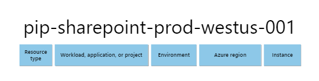
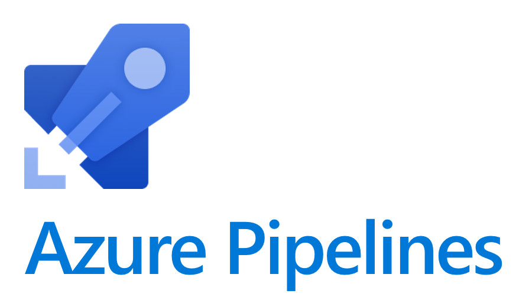

# 🏗️ Template de IaC com Terraform e Terragrunt 🚀

Este repositório serve como um template para projetos de infraestrutura como código, utilizando Terraform e Terragrunt para gerenciar recursos na Azure. ☁️

## 📝 Convenção de Nomenclatura
Seguindo a convenção de nomenclatura recomendada pelo CAF - Cloud Adoption Framework da Microsoft para Azure: (https://learn.microsoft.com/en-us/azure/cloud-adoption-framework/ready/azure-best-practices/resource-naming)



## 📂 Estrutura do Projeto

A estrutura do projeto segue o padrão recomendado pela Gruntwork (https://github.com/gruntwork-io/terragrunt-infrastructure-live-example/) abaixo sendo adaptado para o Azure:

```
.
├── 🗁 terraform
│   └── 🗁 modules
│       ├── 🗁 app
│       │   ├── main.tf
│       │   ├── outputs.tf  
│       │   ├── variables.tf
│       │   └── providers.tf
│       └── 🗁 db
│           ├── main.tf
│           ├── outputs.tf
│           ├── variables.tf
│           └── providers.tf
├── 🗁 terragrunt
│   ├── 🗁 environments
│   │   ├── 🗁 dev
│   │   │   ├── 🗁 eastus2
│   │   │   │   ├── 🗁 resource_groups
│   │   │   │   │   ├── 🗁 001
│   │   │   │   │   │   └── terragrunt.hcl
│   │   │   │   │   └── 🗁 002
│   │   │   │   │       └── terragrunt.hcl
│   │   │   │   ├── 🗁 virtual_networks
│   │   │   │   │   ├── 🗁 vnet
│   │   │   │   │   │   └── 🗁 001
│   │   │   │   │   │       └── terragrunt.hcl
│   │   │   │   │   └── 🗁 peering
│   │   │   │   │       └── 🗁 001
│   │   │   │   │           └── terragrunt.hcl
│   │   │   │   ├── 🗁 compute
│   │   │   │   │   ├── 🗁 vm
│   │   │   │   │   │   └── 🗁 001
│   │   │   │   │   │       └── terragrunt.hcl
│   │   │   │   │   └── 🗁 aks
│   │   │   │   │       └── 🗁 001
│   │   │   │   │           └── terragrunt.hcl
│   │   │   │   └── 🗁 databases
│   │   │   │       └── 🗁 postgres_server
│   │   │   │           └── 🗁 001
│   │   │   │               └── terragrunt.hcl
│   │   │   └── env_dev.hcl
│   │   ├── 🗁 prod
│   │   │   ├── 🗁 brazilsouth
│   │   │   │   ├── 🗁 resource_groups
│   │   │   │   │   │   ├── 🗁 001
│   │   │   │   │   │   │   └── terragrunt.hcl
│   │   │   │   │   │   └── 🗁 002
│   │   │   │   │   │       └── terragrunt.hcl
│   │   │   │   ├── 🗁 virtual_networks
│   │   │   │   │   ├── 🗁 vnet
│   │   │   │   │   │   └── 🗁 001
│   │   │   │   │   │       └── terragrunt.hcl
│   │   │   │   │   └── 🗁 peering
│   │   │   │   │       └── 🗁 001
│   │   │   │   │           └── terragrunt.hcl
│   │   │   │   ├── 🗁 compute
│   │   │   │   │   ├── 🗁 vm
│   │   │   │   │   │   └── 🗁 001
│   │   │   │   │   │       └── terragrunt.hcl
│   │   │   │   │   └── 🗁 aks
│   │   │   │   │       └── 🗁 001
│   │   │   │   │           └── terragrunt.hcl
│   │   │   │   ├── 🗁 databases
│   │   │   │   │   └── 🗁 postgres_server
│   │   │   │   │       └── 🗁 001
│   │   │   │   │           └── terragrunt.hcl
│   │   │   └── env_prod.hcl
│   │   ├── 🗁 hml
│   │   │   ├── 🗁 eastus2
│   │   │   │   ├── 🗁 resource_groups
│   │   │   │   │   └── 🗁 001
│   │   │   │   │       └── terragrunt.hcl
│   │   │   └── env_hml.hcl
│   └── root.hcl
└── 🐧 Makefile
```

# ✍ Pré-requisitos

Tenha instalado no seu terminal:

- Terragrunt (obrigatório: para gerenciar a infraestrutura)
- Terraform (obrigatório: para criar a infraestrutura)
- Azure CLI (obrigatório: para login na Azure)
- make (opcional: para executar os comandos do Makefile)
- graphviz (opcional: para visualizar o grafo de dependências)
>DICA: Utilize o script `assets/scripts/install-tools.sh` para instalar os requisitos e outras ferramentas que julgar necessárias.

1 - Execute o `make structure` para criar a estrutura do projeto.

2 - Logue na conta Azure: Recomendamos utilizar o service principal para login na Azure e utilizar variaveis de ambiente:

```bash
export ARM_CLIENT_ID='00000000-0000-0000-0000-000000000000'
export ARM_CLIENT_SECRET='00000000-0000-0000-0000-000000000000'
export ARM_SUBSCRIPTION_ID='00000000-0000-0000-0000-000000000000'
export ARM_TENANT_ID='00000000-0000-0000-0000-000000000000'
az login --service-principal --username ${ARM_CLIENT_ID} --password ${ARM_CLIENT_SECRET} --tenant ${ARM_TENANT_ID} -o table
```

3. Altere as variaveis do script de criação do backend e execute para criar um Storage Account no Azure para armazenamento do estado do Terraform:

```bash
./assets/scripts/cria-azurerm-backend.sh

 > assets/scripts/cria-azurerm-backend.sh                                                                              
Criando Resource Group...
Executando: az group create --name rg-terragrunt-state-test --location eastus2 --tags Environment=Production Project=Terraform ManagedBy=IaC
✅ Sucesso
Criando Storage Account...
Executando: az storage account create --resource-group rg-terragrunt-state-test --name stterragruntstate17284 --sku Standard_LRS --encryption-services blob --require-infrastructure-encryption true --tags Environment=Production Project=Terraform ManagedBy=IaC
✅ Sucesso
Criando Container...
Executando: az storage container create --name tg-tfstate --account-name stterragruntstate17284
✅ Sucesso
Habilitando versionamento...
Executando: az storage account blob-service-properties update --resource-group rg-terragrunt-state-test --account-name stterragruntstate17284 --enable-versioning true
✅ Sucesso

Backend criado com sucesso!
Resource Group: rg-terragrunt-state-test
Storage Account: stterragruntstate17284
Container: tg-tfstate
Tags aplicadas: Environment=Production Project=Terraform ManagedBy=IaC
```
4. Configure o `root.hcl` com as informações do Storage Account criado e execute o `make init` para inicializar o projeto.
5. Utilize como os templates como referencia localizados em `assets/hcl-templates` para criar os novos ambientes.
6. Execute o `make init`, `make plan` e `make apply` para criar o plano de execução e aplicar as alterações na Azure.

# 🚀 CI/CD

Veja a documentação das soluções de CI/CD para o Azure e GitHub.	

| ✈️ Azure Pipelines | ✈️ GitHub Actions |
|:------------------:|:------------------:|
|  |  |
| [README](assets/azure-pipelines/README.md)  | [README](assets/github-actions/README.md) |


#
# Comandos úteis

## 📦 Gerenciamento de Dependências

###  Visualizar o grafo de dependências do módulo atual
```bash
terragrunt graph-dependencies --working-dir ./terragrunt/environments/dev/eastus2
```

### Visualizar o grafo de dependências de todos os módulos
```bash
terragrunt graph-dependencies --working-dir ./terragrunt/environments/dev/{region}
``` 

### Visualizar o grafo de dependências de todos os módulos em formato PNG
```bash
terragrunt graph-dependencies | dot -Tpng > grafo-dependencias.png
```

## 🔍 Validação e Formatação

### Formatar todos os arquivos HCL recursivamente
```bash
terragrunt hclfmt --working-dir ./terragrunt
```

### Validar a sintaxe de todos os arquivos HCL
```bash
terragrunt hclvalidate --working-dir ./terragrunt
```

### Validar inputs do Terragrunt contra variáveis do Terraform
```bash
terragrunt validate-inputs --working-dir ./terragrunt/environments/dev/eastus2/resource_groups/001
```


## 🔄 Gerenciamento de Estado

```bash
# Visualizar outputs de um módulo
terragrunt output --working-dir ./terragrunt/environments/dev/eastus2/resource_groups/001

# Forçar desbloqueio de estado
terragrunt force-unlock LOCK_ID --working-dir ./terragrunt/environments/dev/eastus2/resource_groups/001
```


## 📋 Melhores Práticas

1. Estrutura de Diretórios Consistente
    - Mantenha a estrutura de diretórios consistente entre ambientes
    - Use numeração para recursos do mesmo tipo (001, 002, etc.)
2. Convenção de Nomenclatura
    - Use prefixos para recursos (rg-, vnet-, vm-, etc.)
    - Inclua ambiente e região no nome dos recursos

3. Gerenciamento de Dependências
    - Use dependency para referenciar outputs de outros módulos
    - Configure mock_outputs para permitir planos quando dependências não existem

4. Variáveis de Ambiente
    - Use arquivos env_.hcl para definir variáveis específicas do ambiente
    - Defina variáveis de autenticação como variáveis de ambiente (ARM_)

5. Módulos Reutilizáveis
    - Mantenha módulos Terraform genéricos e reutilizáveis
    - Use inputs do Terragrunt para configurar os módulos para cada ambiente

6. Execução Parcial
    - Use `--terragrunt-include-dir` e `--terragrunt-exclude-dir` para executar comandos em subconjuntos de módulos

7. aliases úteis

```bash
   # Adicione ao seu .bashrc ou .zshrc
   alias tg='terragrunt'
   alias tgp='terragrunt plan'
   alias tga='terragrunt apply'
   alias tgd='terragrunt destroy'
   alias tgo='terragrunt output'
   alias tgra='terragrunt run-all'
   alias tgrap='terragrunt run-all plan'
   alias tgraa='terragrunt run-all apply'   
```
8. Debugging
```bash
   # Au mentar nível de log para debug
   terragrunt plan --terragrunt-log-level debug
   
   # Renderizar configuração final como JSON
   terragrunt render-json --working-dir ./terragrunt/environments/dev/eastus2/resource_groups/001
```


Maintained by 👨🏻‍💻 [@diogofrj](https://github.com/diogofrj)
